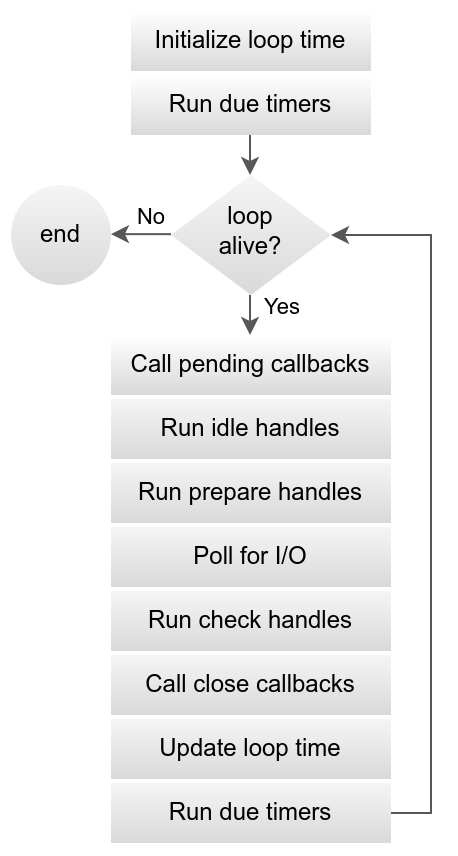
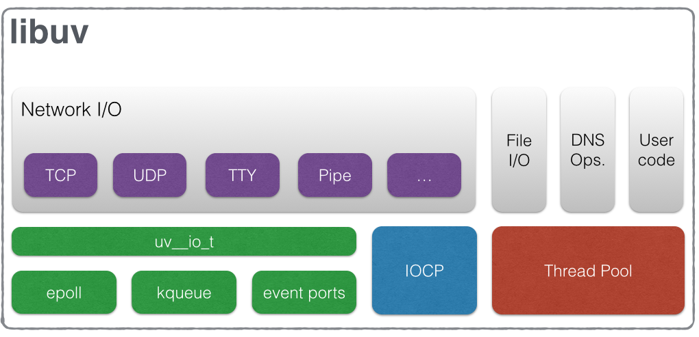

 
 # Libuv — Under the Hood with Node.js
  Overview
 - libuv is a multi-platform C library that provides asynchronous I/O capabilities to Node.js.
 - It’s the engine that powers Node’s non-blocking event loop, enabling operations like networking, file I/O, and timers without blocking the main thread.
## Architecture Diagram
```mathematica
┌────────────────────────────┐
│  JavaScript (Your Code)    │
└───────────────┬────────────┘
                │ JS bindings (Node C++ layer)
                ▼
┌────────────────────────────┐
│        libuv (C layer)     │
│  - Event Loop              │
│  - Thread Pool             │
│  - TCP/UDP sockets         │
│  - Timers                  │
└───────────────┬────────────┘
                ▼
     OS system calls (epoll, kqueue, IOCP)

```
## Libuv event loop workflow


## Libuv’s Main Responsibilities
Event Loop:
 - The heart of Node.js — constantly checks for   pending operations and executes callbacks when ready. \

Handles:
 - Timers (setTimeout, setInterval)
 - I/O operations (network requests, filesystem reads)
 - Idle & prepare callbacks
 - Check phase (e.g., setImmediate)
 - Asynchronous I/O
 - Uses OS-specific mechanisms:
 - Linux: epoll
 - macOS: kqueue
 - Windows: IOCP (I/O Completion Ports)
 - These APIs tell libuv when something is ready, so it doesn’t waste time polling.

## Thread Pool

 - For CPU-bound or blocking tasks (like DNS lookups, file reads, compression), libuv delegates work to a pool of threads.

 - Default: 4 threads (can be changed with UV_THREADPOOL_SIZE).

 - Cross-Platform Abstraction

Node.js code works the same way on Windows, macOS, and Linux — because libuv hides the OS differences.

## Here is a diagram illustrating the different parts that compose libuv and what subsystem they relate to: 
 

## Libuv in Action:
```js
const fs = require('fs');

fs.readFile('file.txt', (err, data) => {
  if (err) throw err;
  console.log(data.toString());
});

```

## What happens:
 - JS Code → Node.js C++ Bindings (fs.readFile → C++ implementation)
 - libuv Thread Pool picks it up (because filesystem is blocking).
 - Thread Pool uses OS syscalls to read the file.
 - Once done, libuv Event Loop schedules the callback.
 - Your callback runs in the next iteration of the loop.

 ## Key Features
 - Full-featured event loop backed by epoll, kqueue, IOCP, event ports.
 - Asynchronous TCP and UDP sockets
 - Asynchronous DNS resolution
 - Asynchronous file and file system operations
 - File system events
 - ANSI escape code controlled TTY
 - IPC with socket sharing, using Unix domain sockets or named pipes (Windows)
 - Child processes
 - Thread pool
 - Signal handling
 - High resolution clock
 - Threading and synchronization primitives 